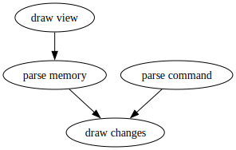

# mem_view
A simple memory view program in C.  
It's built on the Linux virtual memory system, relying on parsing /proc/[pid]/maps and reading /proc/[pid]/mem to achieve its functionality.

## Features
* [x] View heap/stack
* [x] Refresh when size change
* [x] Choose refresh time
* [x] Switch heap/stack view via command line
* [x] Switch heap/stack view using hotkeys

## Args
`./mem_view.out [-s|-h|-t 200|--help] target`

`-s`: View stack (default).
`-h`: View heap.
`-t <time>`: Set refresh interval (default: 500ms).
`--help`: Show help message.

While running:
- Type `s`/`h` to switch between stack/heap view.
- Type `q` or press Ctrl-C to quit.

## Arch

